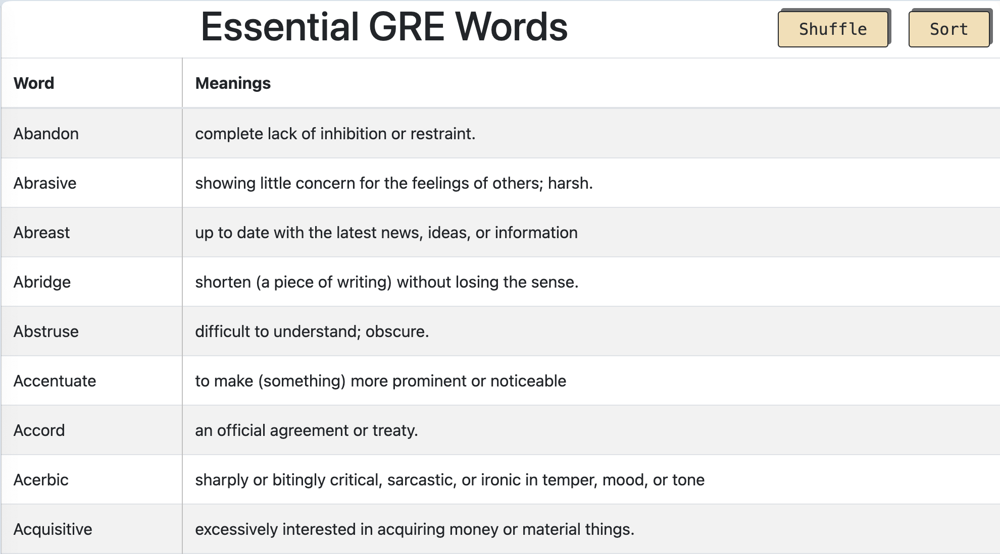

# Essential GRE Words App

This is a simple Angular application designed to help users learn essential GRE words. The application features a list of commonly used GRE words, which can be shuffled and sorted. The word data is dynamically fetched from a linked Google Sheets document, allowing for easy updates and additions.

## App

[https://visnu1.github.io/dict/](https://visnu1.github.io/dict/)

## Screenshots



## Features

- **Dynamic Word List:** Fetches GRE words and their meanings from a Google Sheets document.
- **Shuffle Functionality:** Randomly shuffles the list of words for varied learning.
- **Sort Functionality:** Sorts the words alphabetically or by meaning.
- **Add New Words Easily:** Update the Google Sheet to add or modify words.

## Getting Started

### Prerequisites

- [Node.js](https://nodejs.org/) and npm installed on your machine.
- Angular CLI installed globally. If you haven't installed it yet, you can do so using the following command:

  ```bash
  npm install -g @angular/cli

## Words can be added into the Google sheets

[GRE Words](https://docs.google.com/spreadsheets/d/1WuK2DahQLvqeH_98n1sA-cDyX05MjPCyJhsfbZJVLRI/edit?usp=sharing)

## Contributing

Contributions are welcome! If you have suggestions for improvements or new features, feel free to open an issue or submit a pull request.

## License

This project is open-source and available under the [MIT License](./LICENSE)